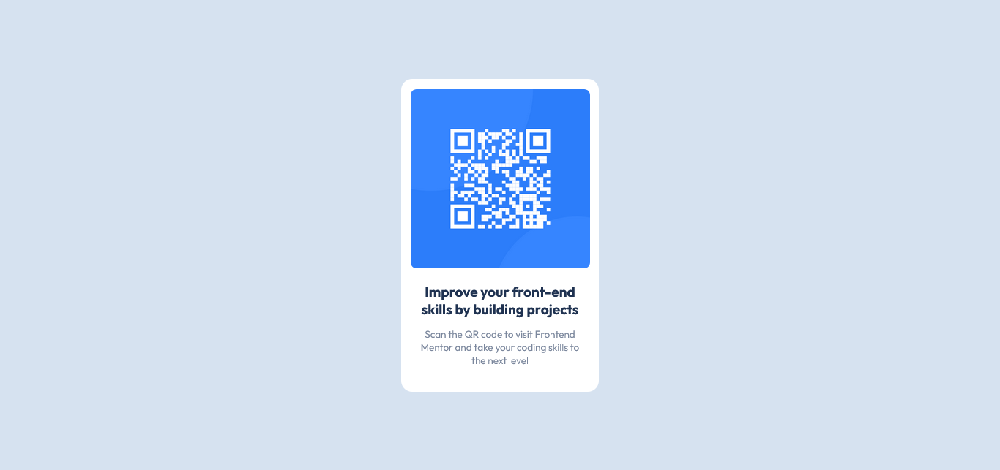

# Frontend Mentor - QR code component solution

This is a solution to the [QR code component challenge on Frontend Mentor](https://www.frontendmentor.io/challenges/qr-code-component-iux_sIO_H). Frontend Mentor challenges help you improve your coding skills by building realistic projects. 

## Table of contents

- [Overview](#overview)
  - [Screenshot] 
  - [Links](#links)
- [My process](#my-process)
  - [Built with](#built-with)
  - [What I learned](#what-i-learned)
  - [Continued development](#continued-development)
  - [Useful resources](#useful-resources)
- [Author](#author)
- [Acknowledgments](#acknowledgments)

## Overview

This challenge allows me to improve my html and css skills, so I thank the frontend mentor for putting real challenges, which makes us keep improving.

### Screenshot



### Links

- Solution URL: [Respository GitHub](https://github.com/GiSofia/QrCode)
- Live Site URL: [GitHub](https://gisofia.github.io/QrCode/)

## My process

### Built with

- Semantic HTML5 markup
- CSS custom properties
- Flexbox
- CSS Grid

### What I learned

I'm highlighting this section because I need to keep practicing css grid and the properties it provides.

```css
figure{
      display: grid;
      grid-template-rows: auto 1fr auto;
      justify-items: center;
    }
```

### Continued development

I would like to continue learning more about CSS, to know its properties very well, as well as to practice the Grid and Flexbox themes more

### Useful resources

- [CSS Tricks](https://css-tricks.com/snippets/css/complete-guide-grid/) - This website helped me a lot with the CSS grid theme, I highly recommend it.

## Author

- Website - [Giuliana Saborío](https://gisofia.github.io/portfolio/)
- Frontend Mentor - [@GiSofia](https://www.frontendmentor.io/profile/GiSofia)

## Acknowledgments

I did this challenge alone, without anyone's help, more than the resources I occupied.


